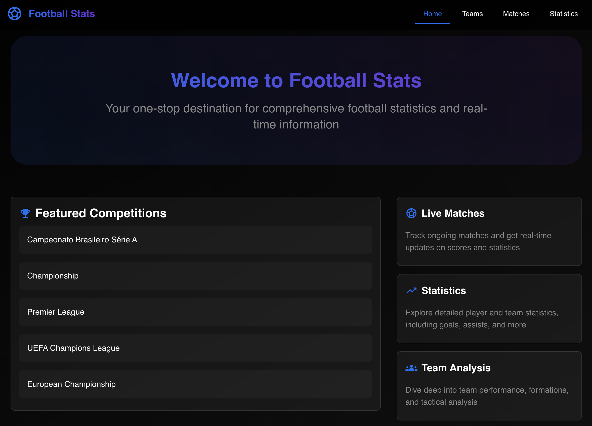
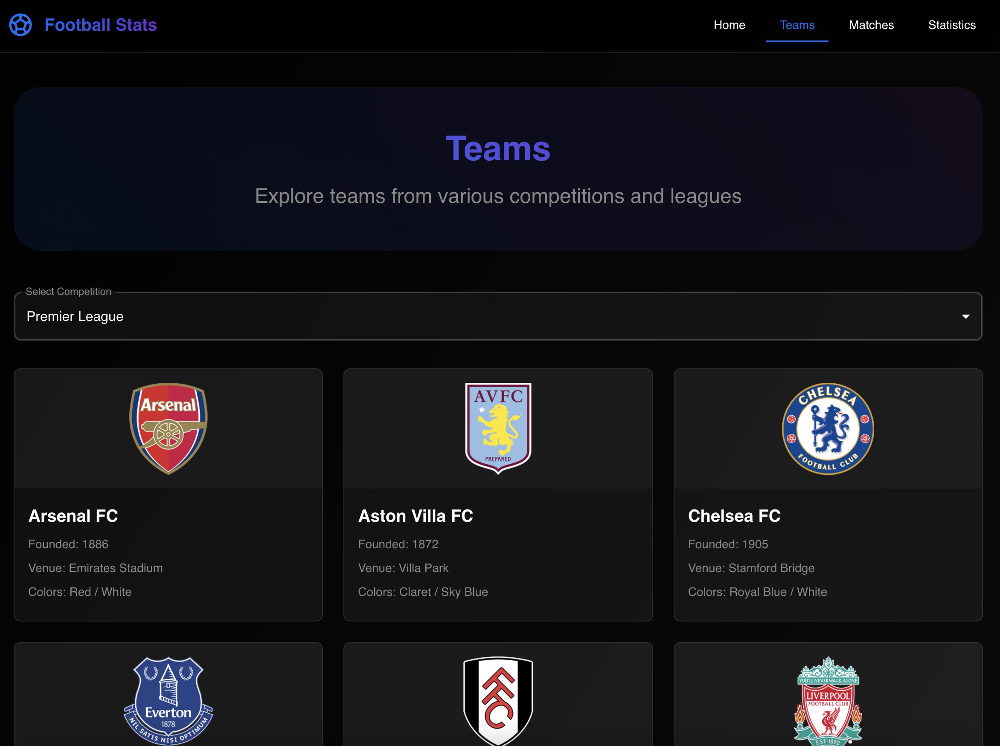
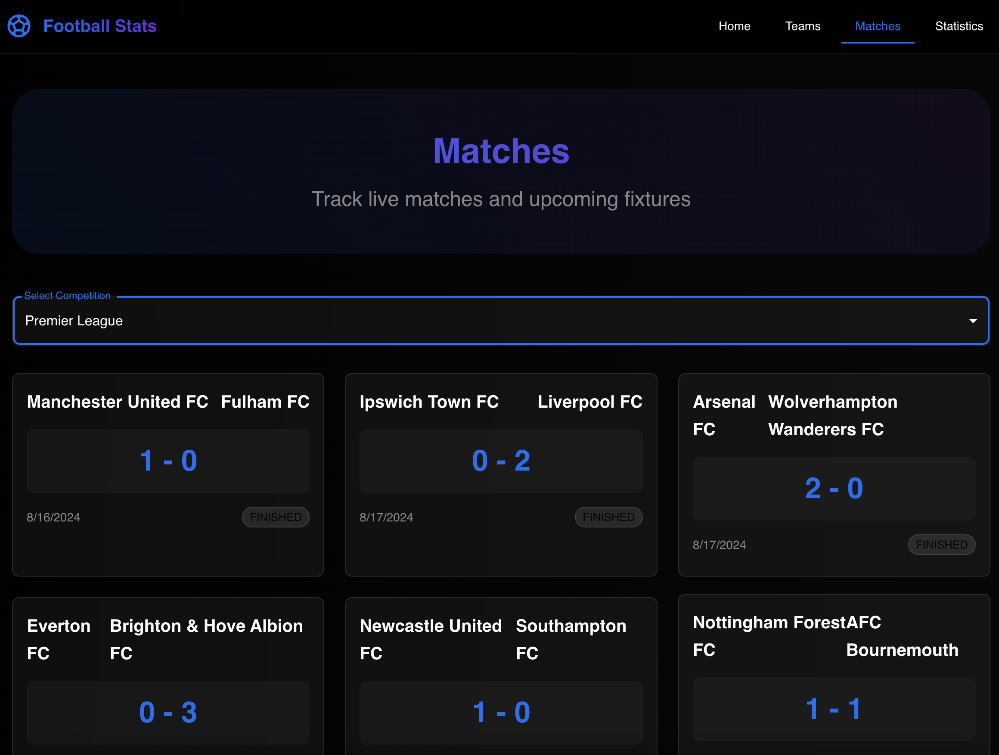
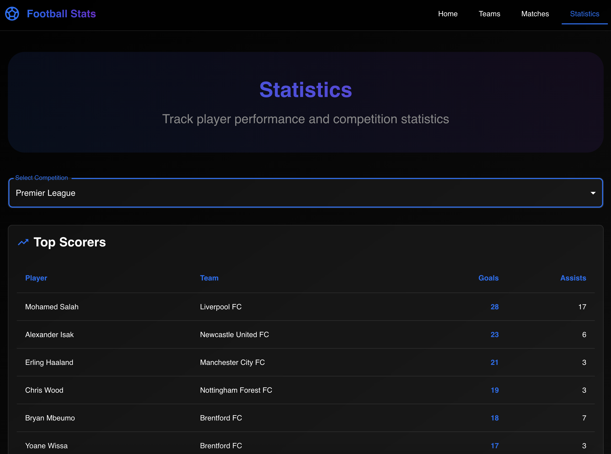

# Football React Vite

A modern football tracking application built with React, Vite, and Material-UI, featuring a sleek Vercel-inspired design.

## Screenshots

### Home Page



### Teams Page


_Browse teams and view detailed information about each team_

### Matches Page


_Track live matches and view upcoming fixtures_

### Statistics Page


_View comprehensive player statistics and top scorers_

## Features

- 🎨 Modern Vercel-inspired UI with glassmorphism effects
- 🌙 Dark theme with gradient accents
- 📱 Fully responsive design
- ⚡ Built with Vite for lightning-fast development
- 🎯 Real-time match tracking
- 📊 Comprehensive statistics
- 🏆 Team and competition information
- 🔄 Live updates

## Tech Stack

- [React](https://reactjs.org/) - UI Library
- [Vite](https://vitejs.dev/) - Build Tool
- [Material-UI](https://mui.com/) - Component Library
- [TypeScript](https://www.typescriptlang.org/) - Type Safety
- [Axios](https://axios-http.com/) - HTTP Client
- [React Router](https://reactrouter.com/) - Routing

## Getting Started

### Prerequisites

- Node.js (v14 or higher)
- npm or yarn

### Installation

1. Clone the repository:

```bash
git clone https://github.com/yourusername/football-react-vite.git
cd football-react-vite
```

2. Install dependencies:

```bash
npm install
# or
yarn
```

3. Create a `.env` file in the root directory and add your API key:

```env
VITE_FOOTBALL_API_KEY=your_api_key_here
```

4. Start the development server:

```bash
npm run dev
# or
yarn dev
```

The application will be available at `http://localhost:5173`

## Project Structure

```
src/
├── components/     # Reusable components
├── pages/         # Page components
├── services/      # API services
├── types/         # TypeScript types
├── utils/         # Utility functions
└── App.tsx        # Main application component
```

## Features in Detail

### Teams Page

- Browse teams from various competitions
- View team details including:
  - Team crest
  - Foundation year
  - Venue
  - Club colors
- Modern card layout with hover effects

### Matches Page

- Track live and upcoming matches
- View match details:
  - Team names
  - Scores
  - Match status
  - Date and time
- Real-time status updates

### Statistics Page

- View top scorers by competition
- Detailed player statistics:
  - Goals scored
  - Assists
  - Team information
- Interactive table with sorting

## Contributing

1. Fork the repository
2. Create your feature branch (`git checkout -b feature/AmazingFeature`)
3. Commit your changes (`git commit -m 'Add some AmazingFeature'`)
4. Push to the branch (`git push origin feature/AmazingFeature`)
5. Open a Pull Request

### Adding Screenshots

When adding new features or making UI changes, please include screenshots in the `docs/screenshots` directory:

1. Take a screenshot of the relevant page/feature
2. Save it in the `docs/screenshots` directory with a descriptive name (e.g., `teams.png`, `matches.png`, `statistics.png`)
3. Update the README.md to include the new screenshot
4. Ensure screenshots are:
   - Clear and well-lit
   - Show the feature in its best state
   - Have a reasonable file size (compress if necessary)
   - Use PNG format for best quality

## License

This project is licensed under the MIT License - see the [LICENSE](LICENSE) file for details.

## Acknowledgments

- [Football-Data.org](https://www.football-data.org/) for providing the football data API
- [Vercel](https://vercel.com/) for the design inspiration
- [Material-UI](https://mui.com/) for the component library
